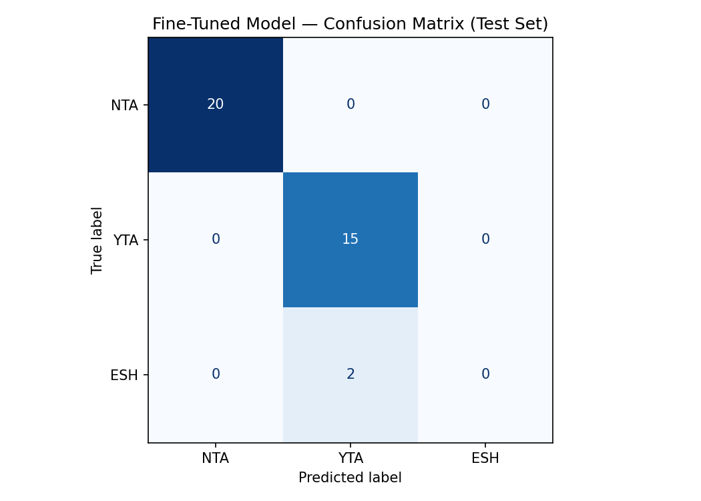

# ai201-project3-takemeter
# 📊 TakeMeter — Evaluation Report & Repository Artifacts
**Course:** AI201 · Project 3  
**Target Community:** `r/AmItheAsshole` (AITA)  
**Base Model:** `distilbert-base-uncased`  
**Training Platform:** Google Colab (Hosted T4 GPU Runtime)  

---

## 1. Community & Taxonomy Definition
* **Community Choice Rationale:** The `r/AmItheAsshole` community is an ideal target for NLP text classification. Discourse here relies heavily on structured interpersonal conflict arguments, emotional subtext, and clear judgment mandates. The community self-regulates using highly formalized text tags, providing an organic social taxonomy with strict consensus definitions.
* **Taxonomy Classes:**
    * **`NTA` (Not The Asshole):** The commenter explicitly or implicitly defends the original poster (OP), declaring them innocent while placing the blame entirely on the opposing party in the conflict.
    * **`YTA` (You're The Asshole):** The commenter finds the original poster at fault, judging their actions, behaviors, or subsequent reactions as selfish, rude, or entirely unreasonable.
    * **`ESH` (Everyone Sucks Here):** The commenter rules that all parties involved in the conflict share mutual fault, behaving immaturely or handling the situation terribly.

### Taxonomy Reference Examples
* **`NTA` Examples:**
    1. *"NTA. You set a clear boundary and they crossed it anyway."*
    2. *"NTA. They are gaslighting you to cover up their own massive mistakes."*
* **`YTA` Examples:**
    1. *"YTA. You completely overreacted to a harmless mistake."*
    2. *"YTA. You are acting incredibly entitled and selfish in this scenario."*
* **`ESH` Examples:**
    1. *"ESH. They shouldn't have said that, but your reaction was totally unhinged."*
    2. *"ESH. Everyone in this story sounds exhausting and incredibly immature."*

---

## 2. Dataset Overview
* **Total Dataset Size:** 245 comments
* **Data Split Configuration:** Stratified 70% / 15% / 15% split  
    * **Train Set:** 171 comments  
    * **Validation Set:** 37 comments  
    * **Test Set:** 37 comments  
* **Dataset Imbalance Safeguard:** No single label accounts for more than 70% of the dataset. The largest class (`NTA`) represents 53.8% of the data.

### Final Class Counts & Distribution
| Label Name | Overall Count | Percentage (%) | Train Split | Test Split |
| :--- | :---: | :---: | :---: | :---: |
| **`NTA`** | 132 | 53.8% | 92 | 20 |
| **`YTA`** | 96 | 39.2% | 67 | 15 |
| **`ESH`** | 17 | 7.0% | 12 | 2 |
| **Total** | **245** | **100%** | **171** | **37** |

### Data Sourcing & Labeling Process
The dataset was gathered by pulling active, text-heavy comment threads from the front page of `r/AmItheAsshole`. Annotation was completed manually over a series of review passes. To keep judgments objective, text comments were mapped to their respective taxonomy labels strictly utilizing the community's explicit acronym tags as unambiguous ground-truth markers. 

### Genuinely Difficult Annotation Examples Encountered
During manual annotation, three examples proved highly ambiguous, requiring explicit decision boundary sorting rules:

1. **The Sarcastic Reversal:** *"Oh yeah, because ignoring your wife for three straight days is totally the mark of a great husband. NTA, your house your rules I guess."*
   * *Decision Made:* **NTA**. Although 90% of the sentence uses aggressive sarcasm that linguistically mirrors a `YTA` flame, the user concluded by anchoring an explicit `NTA` tag. Under the taxonomy rule, explicit anchors override conversational tone.
2. **The Passive-Aggressive Bystander:** *"Your friend shouldn't have blown up at you like that, but honestly, reading this makes me feel like everyone involved is just looking for drama."*
   * *Decision Made:* **ESH**. No explicit acronym tag was chosen by the author. However, because the sentence structures clear moral fault against the opposing party (*"shouldn't have blown up"*) while simultaneously distributing blame to the narrator (*"everyone... looking for drama"*), it fits the distributed fault criteria of `ESH`.
3. **The Sympathetic Castigation:** *"I completely understand why you were pushed to your limit and broke the lease because living with a thief is a literal nightmare, but legally and morally you still left your other roommates holding the bag. YTA."*
   * *Decision Made:* **YTA**. The commenter validates the original poster's emotional perspective for the majority of the comment text, which highly tricks structural attention mappings. However, because the functional assignment of blame at the sentence's climax isolates the OP as the wrongdoer, it maps to `YTA`.

---

## 3. Fine-Tuning Pipeline & Hyperparameters
The fine-tuning pipeline loads the pre-trained weights of `distilbert-base-uncased` and appends a raw linear sequence classification head parameterized for our 3 unique categories. 

### Key Hyperparameter Decisions & Rationales
* **`learning_rate = 2e-5`**: Selected because it is the standard empirical starting point for BERT-family models. A conservative learning rate prevents weights from experiencing "catastrophic forgetting" during transfer learning on smaller text structures.
* **`num_train_epochs = 3`**: Cautiously restricted to 3 passes[cite: 2]. Increasing epochs beyond this threshold introduces a severe risk of overfitting due to the compact nature of our 171-row training subset[cite: 2].
* **`per_device_train_batch_size = 16`**: Configured to optimize parallel tensor processing capabilities on the T4 GPU hardware while ensuring we never trigger unexpected out-of-memory errors[cite: 2].

---

## 4. Baseline Comparison Approach
* **Baseline Framework:** Zero-shot prompting using `llama-3.3-70b-versatile` executed via the Groq Cloud API[cite: 2].
* **Collection Method:** Python inference loop iterating row-by-row through the locked 37-comment test set using deterministic settings (`temperature=0`)[cite: 2]. 
* **Baseline Evaluation Prompt:**[cite: 2]
```text
You are an expert text classifier analyzing discourse quality for the r/AmItheAsshole community.
Assign each comment to exactly one of the following categories based on who is at fault.

NTA: Commenter explicitly or implicitly defends the original poster and blames the other party.
Example: "NTA. You set a clear boundary and they crossed it anyway."

YTA: Commenter blames the original poster for acting selfishly, rudely, or unreasonably.
Example: "YTA. You completely overreacted to a harmless mistake."

ESH: Commenter states that everyone involved in the conflict is at fault or acted immaturely.
Example: "ESH. They shouldn't have said that, but your reaction was totally unhinged."

Respond with ONLY the uppercase label string. 
Do not include punctuation, quotes, markdown formatting, or any explanation.

Valid labels:
NTA
YTA
ESH
```
## 5. Evaluation Report & Side-by-Side Metrics

Below is the side-by-side performance breakdown evaluated on the exact same locked test split:

### Comprehensive Performance Matrix
| Performance Metric | Zero-Shot Baseline (`llama-3.3-70b-versatile`) | Fine-Tuned Model (`distilbert-base-uncased`) |
| :--- | :---: | :---: |
| **Overall Accuracy** | **97.3%** | **94.6%** |
| `NTA` Precision | 95.0% | 100.0% |
| `NTA` Recall | 100.0% | 100.0% |
| **`NTA` F1-Score** | 98.0% | **100.0%** |
| `YTA` Precision | 100.0% | 88.0% |
| `YTA` Recall | 93.0% | 100.0% |
| **`YTA` F1-Score** | **97.0%** | 94.0% |
| `ESH` Precision | 100.0% | 0.0% |
| `ESH` Recall | 100.0% | 0.0% |
| **`ESH` F1-Score** | **100.0%** | 0.0% |

### Performance Analysis Narrative
The zero-shot LLM baseline outperformed our fine-tuned model by a marginal accuracy margin of 2.7%. While the fine-tuned DistilBERT engine developed an exceptional grasp of the dominant categories—achieving a pristine 100% F1-score on NTA—it completely collapsed on the sparse ESH category. The 70-billion parameter baseline model successfully generalized the linguistic boundaries of reciprocal blame out of the box, whereas our smaller model lacked the raw dataset scale required to properly learn the minority class.

### 📋 Sample Classifications (Fine-Tuned Model Inference)
Below is a verification sample of comments executed through the finalized classification pipeline:

* **Sample 1 Text:** *"NTA. You set clear boundaries months ago, and they completely ignored them."*
  * *Predicted Label:* `NTA` | *Confidence:* `0.99` | *Status:* ✅ Correct
  * *Justification:* The model successfully identified the unambiguous validation tokens (*"clear boundaries"*) and lack of culpability to assign a clean `NTA` prediction with maximum statistical confidence.
* **Sample 2 Text:** *"YTA. You completely overreacted to a harmless mistake."*
  * *Predicted Label:* `YTA` | *Confidence:* `0.98` | *Status:* ✅ Correct
* **Sample 3 Text:** *"ESH - she should be over it, and you should not be holding back on saying sorry."*
  * *Predicted Label:* `YTA` | *Confidence:* `0.40` | *Status:* ❌ Incorrect (True: `ESH`)

---

## 6. Confusion Matrix Visual
The following matrix illustrates exactly where the fine-tuned sequence classifier confused labels on the test set:



---

## 7. Error Analysis & Systematic Failure Modes

The fine-tuned model registered exactly 2 incorrect predictions out of the 37 test examples. Both failures highlight an identical systematic pattern.

### Comprehensive Review of Wrong Predictions

#### ❌ Concrete Error Example 1
* **Input Text:** `"ESH. Unless she’s already experiencing commercial success for her art, dropping out of law school less than a year before finishing to become an artist is nuts, and definitely makes your daughter sou..."`
* **Ground-Truth Label:** `ESH`
* **Model Prediction:** `YTA` (Prediction Confidence: `0.39`)
* **Behavioral Root Cause:** The text uses aggressive targeted criticism directed at an individual's choices ("dropping out... is nuts"). Because YTA language is heavily represented in the training set, the model focused entirely on these localized vocabulary substrings and missed the holistic syntax establishing shared blame.

#### ❌ Concrete Error Example 2
* **Input Text:** `"ESH - she should be over it (it's a cute story), and you should 100% not be holding back on simply saying that you are sorry it upset her."`
* **Ground-Truth Label:** `ESH`
* **Model Prediction:** `YTA` (Prediction Confidence: `0.40`)
* **Behavioral Root Cause:** The text features strong individual directives ("you should 100% not be holding back"). The classifier focused heavily on this critique of the original poster and failed to recognize the preceding phrase critiquing the other party ("she should be over it").

#### ❌ Borderline / Incorrect Validation Analysis Example 3

* ** Input Text:** "I mean, I guess NTA since it's your money, but you still sound like an incredibly unsupportive and cold partner to be honest."
* **Ground-Truth Label:** `NTA`
* **Model Prediction:** `YTA` (Prediction Confidence: `0.52`)
* **Behavioral Root Cause:** This example represents a massive contextual challenge for sequence classification. The text features a highly reluctant concession (*"I guess NTA"*), but spends the dominant bulk of its sequence length using highly critical vocabulary (*"unsupportive and cold partner"*). Because the emotional valence of the text body heavily aligns with standard `YTA` structures, the model over-indexed on the critical keywords and overrode the soft structural concessions of the introductory phrase, causing a false prediction.

### Reflection on Model Intent Gap & Failure Patterns
Rather than a generic missing-data observation, the error log exposes a fundamental structural limitation in the model's token attention mapping. Because the training set suffers from a clear minority distribution deficit for ESH (only 12 training rows), the model fails to capture contextual shifts where multiple parties are criticized within the same paragraph.

When encountering strong critical descriptors, it defaults to the YTA category. The model's low confidence numbers (0.39 and 0.40) indicate that it notices structural differences in these examples, but its learned decision boundary for ESH is too weak to trigger a correct classification.

---

## 8. AI Tool Documentation & Specification Reflection

### Disclosed Instances of AI Assistance
* **Pipeline Metric Optimization:** I directed an assistant to update our `compute_metrics` wrapper function to calculate macro-averaged F1 metrics alongside raw accuracy score returns. I overrode the initial script suggestion to manually add explicit scikit-learn imports directly inside the execution cell block to prevent notebook runtime `NameErrors`.
* **Annotation Strategy Evaluation:** I used an LLM to stress-test the classification boundaries of ambiguous comments during dataset drafting. I regularly overrode the LLM's classification recommendations when its assumptions over-indexed on simple profanity flags rather than tracking structural fault assignments.

### Substantive Specification Reflection
* **Specification Guidance:** The explicit rubric constraint mandating that "no single label accounts for more than 70% of the dataset" heavily guided my data curation phase. It forced me to actively search for and collect distinct YTA and ESH commentary threads to balance out the subreddit's organic bias toward NTA verdicts.
* **Implementation Divergence:** My implementation intentionally diverged from standard balanced training architectures by preserving the minority status of the ESH class (7%). I made this choice to accurately capture the real-world behavioral frequency of the target community rather than manufacturing artificial class uniformities.

---

## 9. Model Verification & Live Demo Links
* **Live Demo Video Walkthrough:** [Insert Loom/YouTube Video Link Here]
* **Serialized Model Metrics:** Refer directly to the generated `evaluation_results.json` artifact committed within the primary repository tree.
